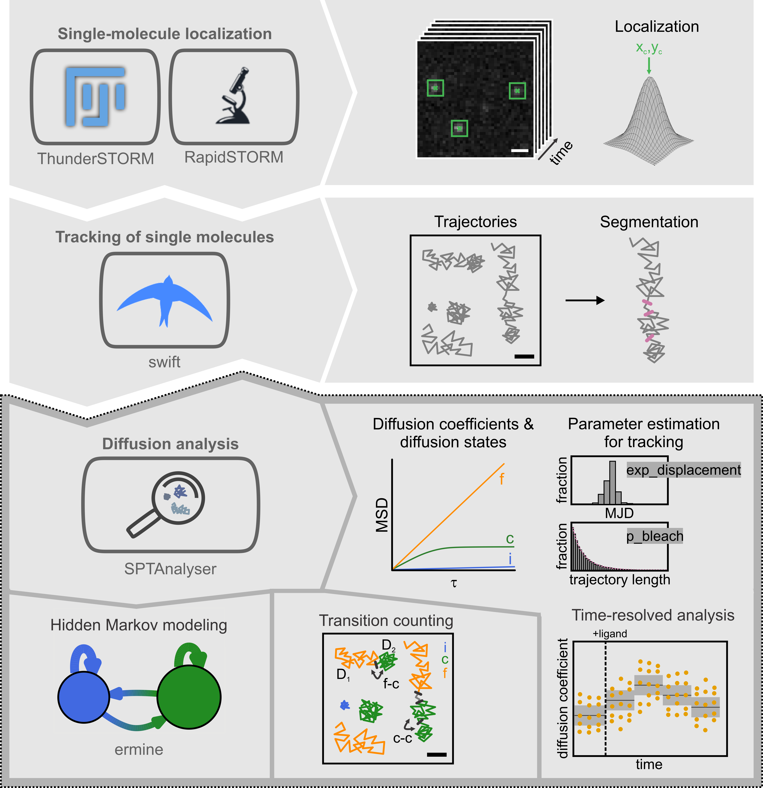

# SPTAnalyser

Processing of single particle tracking data:
- MSD-based extraction of diffusion coefficients and diffusion types
- Time resolved analysis of MSD-based analysis
- Transition counting between different diffusion modes
- Hidden Markov modeling with ermine<sup>[1]</sup>

The pipeline is compatible with PALMTracer<sup>[2]</sup>, rapidSTORM<sup>[3]</sup>, ThunderSTORM<sup>[4]</sup> and swift<sup>[5]</sup></br>



## To install the package run

```
cd C:\path\to\SPTAnalyser
conda create --name SPTAnalyser python=3.8
conda activate SPTAnalyser
conda install pip pywin32
pip install jupyterlab
python -m pip install pyErmine
pip install SPTAnalyser-XXX-py3-none-any.whl
pip install jupyter_contrib_nbextensions
jupyter notebook
```

The analysis is described in great detail in the [Manual_Tracking_Routine.pdf](https://github.com/HeilemannLab/SPTAnalyser/blob/master/Manual_Tracking_Routine.pdf). Give the analysis a try with the test files in the dataset folder, including localization files from ThunderSTORM, tracked files from swift, and SPTAnalyser trackAnalysis output.
More single-particle tracking data can be found at https://www.ebi.ac.uk/biostudies/studies/S-BSST712.

## Contributors
Johanna Rahm, Sebastian Malkusch, Marie-Lena Harwardt, Marina Dietz, Claudia Catapano, Alexander Niedrig

## Literature
[1] https://github.com/SMLMS/pyErmine </br>
[2] [PALMTracer download](https://docs.google.com/forms/d/e/1FAIpQLSdxkJXmoc5uRqoL8kzCSV2Rv90kEfRMIoaPuk--Bpm0Lttb0g/viewform) </br>
[3] S. Wolter, A. Löschberger, T. Holm, S. Aufmkolk, M.-C. Dabauvalle, S. van de Linde, M. Sauer, 2012, Nature Methods, 9, 1040-1041, DOI: 10.1038/nmeth.2224 </br>
[4] M. Ovesny, P. Krizek, J. Borkovec, Z. Svindrych, G. M. Hagen, 2014, Bioinformatics, 30, 2389-2390, DOI: 10.1093/bioinformatics/btu202 </br>
[5] M. Endesfelder, C. Schießl, B. Turkowyd, T. Lechner, U. Endesfelder, Manuscript in Prep.; [swift download](http://bit.ly/swifttracking) </br>

## Citation
Please cite our paper when using SPTAnalyser for your research. </br>
J. V. Rahm, S. Malkusch, U. Endesfelder, M. S. Dietz, M. Heilemann, Front. Comput. Sci., 12 November 2021, https://doi.org/10.3389/fcomp.2021.757653
